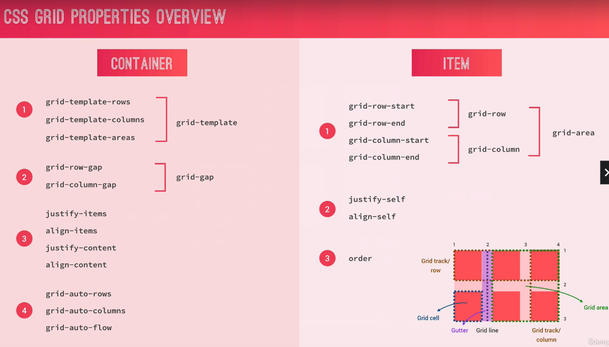

# Layout Types

- `Float`: still used, but outdated
- `Flexbox`: laying out elements in a `1-dimensional` row; perfect for `component layout`
  - main idea of flexbox is to give the container the ability to expand and shrink elements to best use available space
- `CSS Grid`: laying out element in a fully-fledged `2-dimensional` grid; perfect for `page layouts and complex components`

## Flexbox

- complete explanation: <https://css-tricks.com/snippets/css/a-guide-to-flexbox/>

- Container Properties (first value = default)
  - `flex-direction: row | row-reverse | column | column-reverse`
  - `flex-wrap: nowrap | wrap | wrap-reverse`
  - `justify-content: flex-start | flex-end | center | space-between | space-around | space-evenly`
  - `align-items: stretch | flex-start | flex-end | center | baseline`
    - stretch: if at least one flex item has greater height, all flex items are stretched to this height
    - baseline: align to a common text-line of all flex items
  - `align-content: stretch | flex-start | flex-end | center | space-between | space-around`
    - if you use `wrap` , have at least 2 lines and have a greater height for the container, you can align the rows in the container
- Flex-Item Properties (first value = default)
  - `align-self: auto | stretch | flex-start | flex-end | center | baseline`
  - `order: 0 | <integer>`
  - `flex: 0 1 auto | <int> <int> <len>`
    - `flex-grow: 0 | <integer>`
      - value `0`: item keeps attributed size (`width`/`height`)
      - value `1`: item occupies as much space as it can
      - items width different values: e.g. `2` -> these items grow twice as fast (take up twice the space)
    - `flex-shrink: 1 | <integer>`
      - value `0`: item it NOT allowed to shrink
    - `flex-basis: auto | <length>`
      - fixed size (`width`/`height`) for item

### Example: Grid Layout with Flexbox

- explanation: <https://www.taniarascia.com/easiest-flex-grid-ever/>

```HTML
<section class="grid-test">
  <div class="row">
    <div class="col-1-of-2">Col 1 of 2</div>
    <div class="col-1-of-2">Col 1 of 2</div>
  </div>
  <div class="row">
    <div class="col-1-of-3">Col 1 of 3</div>
    <div class="col-1-of-3">Col 1 of 3</div>
    <div class="col-1-of-3">Col 1 of 3</div>
  </div>
  <div class="row">
    <div class="col-1-of-3">Col 1 of 3</div>
    <div class="col-2-of-3">Col 2 of 3</div>
  </div>
  <div class="row">
    <div class="col-1-of-4">Col 1 of 4</div>
    <div class="col-1-of-4">Col 1 of 4</div>
    <div class="col-1-of-4">Col 1 of 4</div>
    <div class="col-1-of-4">Col 1 of 4</div>
  </div>
  <div class="row">
    <div class="col-1-of-4">Col 1 of 4</div>
    <div class="col-1-of-4">Col 1 of 4</div>
    <div class="col-2-of-4">Col 2 of 4</div>
  </div>
  <div class="row">
    <div class="col-1-of-4">Col 1 of 4</div>
    <div class="col-3-of-4">Col 3 of 4</div>
  </div>
</section>
```

```SCSS
// layout/_grid.scss
$grid-width: 114rem;
$gutter-vertical: 8rem;
$gutter-horizontal: 6rem;

// how to write flexbox grid mobile first: https://www.taniarascia.com/easiest-flex-grid-ever/
.grid {
  display: flex;
  flex-direction: column;
  row-gap: $gutter-vertical;
}

.row {
  display: flex;
  flex-flow: column nowrap;
  row-gap: $gutter-vertical;
  column-gap: $gutter-horizontal;
  width: 100%;
  max-width: 114rem; // 1rem = 10px (root font-size);
  margin: 0 auto;

  // selects all elements with class atribute starting with 'col-...'
  // ^ starts with
  // $ ends with
  // * contains it
  [class^='col-'] {
    // ...
  }
}

@media screen and (min-width: 800px) {
  .row {
    flex-flow: row nowrap;

    .col-1-of-2 {
      flex: 1;
    }

    .col-1-of-3 {
      flex: 1;
    }

    .col-2-of-3 {
      flex: 2;
    }

    .col-1-of-4 {
      flex: 1;
    }

    .col-2-of-4 {
      flex: 2;
    }

    .col-3-of-4 {
      flex: 3;
    }
  }
}
```

## CSS Grid

- `2-dimensional` grid system
- Grid works perfectly together with Flexbox (-> which is `1-dimensional`)
- use Firefox `dev tools` to inspect grid layout



- Terminology:
  - `display: grid`: creating grid container
  - `column axis`, `row axis`: direction
  - `grid line`
    - automatically numbered lines that devide the columns and the rows
    - numbering starts at 1 and is made for column and row axis
    - for column: 1 starts at upper left corner
    - for row: 1 starts at upper right corner
    - total numbers of lines (quantity of columns + 1, quantity of rows + 1)
  - `row gutter` and `column gutter`: space between rows and columns
  - `grid track`: space between 2 `grid lines`, no matter if vertical (-> `row`) or horizontal (-> `column`)
  - `grid area`: area between 2 horizontal AND 2 vertical `grid lines` (e.g. col line 1 to 4 and row line 1 to 3)
  - `grid cell`: `area` between 2 adjacent horizontal and vertical `grid lines` (e.g. col line 1 to 2 and row line 1 to 2)
- Container Properties (first value = default)
  - `grid-template`
    - `grid-template-rows`
    - `grid-template-columns`
    - `grid-template-areas`
  - `grid-gap`
    - `grid-row-gap`
    - `grid-column-gap`
  - `justify-items`
  - `align-items`
  - `justify-content`
  - `align-content`
  - `grid-auto-rows`
  - `grid-auto-columns`
  - `grid-auto-flow`
- Grid-Item Properties (first value = default)
  - `grid-area`
    - `grid-row`
      - `grid-row-start`
      - `grid-row-end`
    - `grid-column`
      - `grid-column-start`
      - `grid-column-end`
  - `justify-self`
  - `align-self`
  - `order`

### Example: Basic Propterties Grid Layout

```HTML
<div class="container">
  <div class="item item--1">1: Orange</div>
  <div class="item item--2">2: Green</div>
  <div class="item item--3">3: Violet</div>
  <div class="item item--4">4: Pink</div>
  <div class="item item--5">5: Blue</div>
  <div class="item item--6">6: Brown</div>
</div>
```

```SCSS
.container {
  background-color: #eee;
  width: 900px;
  margin: 30px auto;

  display: grid;
  grid-template-rows: 150px 150px; // define number of grid tracks and its heights
  grid-template-rows: repeat(2, 150px); // shorthand for repeating identical track

  grid-template-columns: repeat(2, 150px) 300px; // define number of grid tracks and its width
  grid-template-columns: repeat(2, 150px) 1fr; // fr = fractional unit, this track expands to remaining space
  grid-template-columns: repeat(3, 1fr); // divide entire space into 3 identical parts, like "flex-grow: 1" for all tracks
  grid-template-columns: 1fr 2fr 1fr;
  grid-template-columns: 50% 2fr 1fr; // combine units, notice that gap does NOT belong to the split space in the calc of the tracks

  // grid-row-gap: 30px; // gap between rows
  // grid-column-gap: 50px; // gap between cols
  grid-gap: 30px 50px;
}

.item {
  padding: 20px;
  font-size: 30px;
  color: #fff;

  // at first, items are automatically placed in normal order
  &--1 {
    background-color: orange;
    // position item in grid cell between row grid line 2 and 3 and col grid line 2 and 3
    grid-row-start: 2;
    grid-row-end: 3;
    grid-column-start: 2;
    grid-column-end: 3;

    // shorthand for positioning
    grid-row: 2 / 3; // row line start | row line end
    grid-column: 2 / 3; // col line start | col line end
  }

  &--2 {
    background-color: green;
    grid-row: 1 / 2;
    grid-column: 3 / 4;

    // shorthand for grid-row and grid-column
    grid-area:  1 / 3 / 2 / 4  // row line start | col line start | row line end | col line end
  }

  &--3 {
    background-color: violet;
    grid-column: 1 / 3; // span element over 2 cols, a) if no remaining space, last item moves to new row track (even if it's not explicitly defined in grid-template), b) if another item is explicitly positioned in same grid cell, then they are on top of each other (-> multiple items can be in same cell -> you can use z-index)
    grid-row: 2 / 3;
  }

  &--4 {
    background-color: pink;
    grid-column: 2 / span 2; // equal to 2 / 4; span item over 2 cols
    grid-column: 2 / -1; // -1 means that item is spannend until last col
  }

  &--5 {
    background-color: blue;
  }

  &--6 {
    background-color: brown;
  }
}
```

### Basic Grid Layout - V1: Line Numbers

```HTML
<div class="container">
  <div class="header">Header</div>
  <div class="box--1">Box 1</div>
  <div class="box--2">Box 2</div>
  <div class="box--3">Box 3</div>
  <div class="sidebar">Sidebar</div>
  <main class="main">Main content</main>
  <footer class="footer">Footer</footer>
</div>
```

```SCSS
// METHOD 1: LINE NUMBERS
.container {
  width: 600px;
  height: 500px;
  margin: 0 auto;
  display: grid;
  grid-template-rows: 1fr 2fr 4fr 1fr;
  grid-template-columns: repeat(3, 1fr) 150px;
  grid-gap: 20px;

  & > * {
    background-color: red;
    color: #fff;
    padding: 10px;
  }
}

.header {
  grid-area: 1 / 1 / 2 / -1; // row line start | col line start | row line end | col line end
}

.box--1 {
  grid-area: 2 / 1 / 3 / 2;
}

.box--2 {
  grid-area: 2 / 2 / 3 / 3;
}

.box--3 {
  grid-area: 2 / 3 / 3 / 4;
}

.sidebar {
  grid-area: 2 / 4 / span 2 / -1;
}

.main {
  grid-area: 3 / 1 / 4 / span 3;
}

.footer {
  grid-area: 4 / 1 / -1 / -1;
}
```

### Basic Grid Layout - V2: Line Names

```SCSS
// METHOD 2: LINE NAMES
.container {
  width: 600px;
  height: 500px;
  margin: 0 auto;
  display: grid;
  grid-template-rows: [header-start] 1fr [header-end box-start] 2fr [box-start main-start] 4fr [main-end footer-start] 1fr [footer-end]; // naming line with [NAME-start] [NAME-end], since line is start AND end point of track use [NAME-end ANOTHER-NAME-start]
  grid-template-columns: repeat(3, [col-start] 1fr [col-end]) 150px; // create name set for grid lines: col-start 1 col-end 1, col-start 2 col-end 2 ... last one is called "grid-end"
  grid-gap: 20px;

  & > * {
    background-color: red;
    color: #fff;
    padding: 10px;
  }
}

.header {
  grid-area: 1 / col-start 1 / 2 / grid-end; // row line start | col line start | row line end | col line end
}

.box--1 {
  grid-area: 2 / 1 / 3 / 2;
}

.box--2 {
  grid-area: 2 / 2 / 3 / 3;
}

.box--3 {
  grid-area: 2 / 3 / 3 / 4;
}

.sidebar {
  grid-area: box-start / col-end 3 / main-end / grid-end;
}

.main {
  grid-area: 3 / 1 / 4 / span 3;
}

.footer {
  grid-area: 4 / col-start 1 / -1 / grid-end;
}
```

### Basic Grid Layout - V3: Name Grid Areas

```SCSS
// METHOD 3: NAME GRID AREAS -> easy to use for small layouts
.container {
  width: 600px;
  height: 500px;
  margin: 0 auto;
  display: grid;
  grid-template-rows: 1fr 2fr 4fr 1fr;
  grid-template-columns: repeat(3, 1fr) 150px;
  grid-gap: 20px;

  // define names for grid areas
  // every grid cell gets a name, make an exact copy of the layout
  // leave cell empty with "."
  grid-template-areas: ". head head ."
                       "box-1 box-2 box-3 side"
                       "main main main side"
                       "foot foot foot foot";

  & > * {
    background-color: red;
    color: #fff;
    padding: 10px;
  }
}

.header {
  // another way to use grid-area property: with area names
  grid-area: head; // all "head" cells in a grid track will be occupied
}

.box--1 { grid-area: box-1; }
.box--2 { grid-area: box-2; }
.box--3 { grid-area: box-3; }
.sidebar { grid-area: side; }
.main { grid-area: main; }
.footer { grid-area: foot; }
```

### Explicit vs Implicit Grids

- if you have more items than cells, more tracks are added and remaining items move to a new implicit grid row (or column) track
- `grid-auto-rows`: set height of implicit row track(s)
- `grid-auto-columns`: set width of implicit col track(s) - only applies with grid-auto-flow: column
- `grid-auto-flow: row`: default = row; change grid direction: with `column` new cols are added as implicit column track(s)
  - `grid-auto-flow: row dense` -> avoid holes when algorithme arrange grid items (when they are NOT explicitly positioned)

```HTML
<div class="container">
  <div class="item item--1">1</div>
  <div class="item item--2">2</div>
  <div class="item item--3">3</div>
  <div class="item item--4">4</div>
  <div class="item item--5">5</div>
  <div class="item item--6">6</div>
  <div class="item item--7">7</div>
  <div class="item item--8">8</div>
</div>
```

```SCSS
.container {
  width: 600px;
  margin: 0 auto;
  background-color: #ddd;

  display: grid;
  // explicit grid definition
  grid-template-rows: repeat(2, 150px);
  grid-template-columns: repeat(2, 1fr);
  grid-gap: 20px;

  // implicit grid definition
  grid-auto-rows: 50px;
  grid-auto-flow: row; // [default: row] | column | row dense | column dense
  grid-auto-columns: .5fr;
}

.item {
  padding: 10px;
  color: #fff;
  background-color: red;
}
```

### Align Grid Items to Grid Areas

- `align-item`/`justify-item`
  - align = vertically (-> column direction)
  - justify = horizontally (-> row direction)
- `align-self`/`justify-self`: for grid items to overwrite `align-item`/`justify-item` properties of grid container

```SCSS
.container {
  width: 600px;
  margin: 0 auto;
  background-color: #ddd;

  display: grid;
  grid-template-rows: repeat(6, 150px);
  grid-template-columns: repeat(2, 1fr);
  grid-gap: 20px;

  align-items: center; // [default = stretch] | center | end | start; e.g. with center each item is centered vertically in its grid area, can also be a only a cell (-> works like flex-box align-items: center)
  justify-items: center; // [default = stretch] | center | end | start; e.g. start aligns item horizontally on left side in its grid area
}

.item {
  padding: 10px;
  color: #fff;
  background-color: red;

  &--4 {
    background-color: orange;
    grid-row: 2 / span 3;
    align-self: start;
    justify-self: start;
  }

  &--7 {
    background-color: green;
    grid-column: 1 / -1;
  }
}
```

### Align Grid Tracks (-> entire content) to Grid Container

- matters if grid container is larger than grid content
- `grid-auto-flow: row dense` -> avoid holes when algorithme arrange grid items (when they are NOT explicitly positioned) -> use `dense`

```SCSS
.container {
  width: 600px;
  height: 600px;
  margin: 0 auto;
  background-color: #ddd;

  display: grid;
  grid-template-rows: repeat(6, 50px);
  grid-template-columns: repeat(2, 200px);
  grid-gap: 20px;

  justify-content: center; // [default = start] | end | center | space-between | space-around | space-evenly -> align content horizontally (row direction)
  align-content: center; // align content vertically (col direction)

  // avoid holes in grid layout with "dense"
  grid-auto-flow: row dense;
}

.item {
  padding: 10px;
  color: #fff;
  background-color: red;

  &--4 {
    background-color: orange;
    grid-row: 2 / span 3;
  }

  &--6 {
    background-color: purple;
    grid-row: 2 / span 2;
  }

  &--7 {
    background-color: green;
    grid-column: 1 / -1;
  }
}
```

### Grid: min-content, max-content

- `max-content`: width of largest content of a grid item in this column or row WITHOUT line break
- `min-content`:
  - for column track: column takes largest width that is needed to fit the grid item content without overflowing
  - for row track: row takes largest height that is needed to fit the grid item content without overflowing
  - example `grid-template-columns: max-content 1fr 1fr min-content`: column track is set to min-content, `Loremipsum` is largest word and so largest content in grid item, now NO overflowing to right and left, BUT overflowing to bottom remains possible;
  - if row track is also set to min-content (`grid-template-rows: repeat(2, min-content)`), then grid item content fits perfectly without any overflowing

```HTML
<div class="container">
  <div class="item item--1">1: Hello hello hello</div>
  <div class="item item--2">2</div>
  <div class="item item--3">3</div>
  <div class="item item--4">4: Ich teste und teste und code</div>
  <div class="item item--5">5</div>
  <div class="item item--6">6</div>
  <div class="item item--7">7</div>
  <div class="item item--8">8: Loremipsum ipsum lorem ipsum lorem ipsum lorem ipsum lorem ipsum</div>
</div>
```

```SCSS
.container {
  width: 600px;
  height: 600px;
  margin: 0 auto;
  background-color: #ddd;

  display: grid;
  grid-template-rows: repeat(2, 150px);
  grid-template-columns: max-content 1fr 1fr min-content;
  grid-template-rows: repeat(2, min-content);
}

.item {
  padding: 10px;
  color: #fff;
  background-color: red;

  &--1 { background-color: red; }
  &--2 { background-color: orange; }
  &--3 { background-color: blue; }
  &--4 { background-color: green; }
  &--5 { background-color: orangered; }
  &--6 { background-color: purple; }
  &--7 { background-color: violet; }
  &--8 { background-color: darkblue; }
}
```

### Grid: minmax()

- `minmax()`: ensure that grid track stays between 2 defined values
  - example `grid-template-rows: repeat(2, minmax(150px, min-content))`: row has at least height of `150px`, BUT if content is larger then grid item becomes heigher

```SCSS
.container {
  height: 600px;
  margin: 0 auto;
  background-color: #ddd;

  display: grid;

  width: 90%;
  grid-template-rows: repeat(2, minmax(150px, min-content));
  grid-template-columns: minmax(200px, 50%) repeat(3, 1fr); // first col keeps 50% (-> can also use units px, fr) as long as there is enough space for all other grid tracks, only then col shrinks until min value of 200px
}

.item {
  padding: 10px;
  color: #fff;
  background-color: red;

  &--1 { background-color: red; }
  &--2 { background-color: orange; }
  &--3 { background-color: blue; }
  &--4 { background-color: green; }
  &--5 { background-color: orangered; }
  &--6 { background-color: purple; }
  &--7 { background-color: violet; }
  &--8 { background-color: darkblue; }
}
```

### Grid: auto-fill and auto-fit to build responsive layouts

- `auto-fill` creates automatically as many tracks as fit in the grid container's width (1000px/100px = 10 col tracks), also empty tracks when there are NOT enough grid items
- `auto-fit` creates automatically as many tracks as fit in the grid container, BUT if track can NOT be filled with available grid items, then these tracks collapse to width 0
- combined with `minmax()`, you can easily create responsive layouts

```SCSS
.container {
  width: 1000px;
  height: 100%;
  margin: 0 auto;
  background-color: #ddd;

  display: grid;

  grid-template-rows: repeat(2, minmax(150px, min-content));
  grid-template-columns: repeat(auto-fill, 100px);

  grid-template-columns: repeat(auto-fit, 100px);

  // combined with minmax(): according to a relative container width and with 8 grid items, until 800px width 8 col tracks are created, but if less than 800px width, then break to next row line and only 7 col tracks remain in grid
  width: 90%;
  grid-template-columns: repeat(auto-fit, minmax(100px, 1fr));
  grid-auto-rows: 150px; // if explicit grid is not enough for all grid items, define auto-created new track(s)
}

.item {
  padding: 10px;
  color: #fff;
  background-color: red;

  &--1 { background-color: red; }
  &--2 { background-color: orange; }
  &--3 { background-color: blue; }
  &--4 { background-color: green; }
  &--5 { background-color: orangered; }
  &--6 { background-color: purple; }
  &--7 { background-color: violet; }
  &--8 { background-color: darkblue; }
}
```
