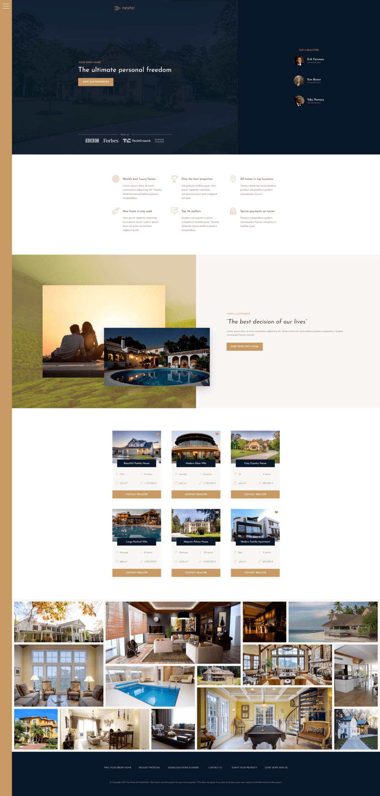

# CSS Grid

- `2-dimensional` grid system
- Grid works perfectly together with Flexbox (-> which is `1-dimensional`)
- use Firefox `dev tools` to inspect grid layout


- Terminology:
  - `display: grid`: creating grid container
  - `column axis`, `row axis`: direction
  - `grid line`
    - automatically numbered lines that devide the columns and the rows
    - numbering starts at 1 and is made for column and row axis
    - for column and row: 1 starts at upper left corner
    - total numbers of lines (quantity of columns + 1, quantity of rows + 1)
  - `row gutter` and `column gutter`: space between rows and columns
  - `grid track`: space between 2 `grid lines`, no matter if vertical (-> `row`) or horizontal (-> `column`)
  - `grid area`: area between 2 horizontal AND 2 vertical `grid lines` (e.g. col line 1 to 4 and row line 1 to 3)
  - `grid cell`: `area` between 2 adjacent horizontal and vertical `grid lines` (e.g. col line 1 to 2 and row line 1 to 2)
- Container Properties
  - `grid-template`
    - `grid-template-rows`
    - `grid-template-columns`
    - `grid-template-areas`
  - `grid-gap`
    - `grid-row-gap`
    - `grid-column-gap`
  - `justify-items`
  - `align-items`
  - `justify-content`
  - `align-content`
  - `grid-auto-rows`
  - `grid-auto-columns`
  - `grid-auto-flow`
- Grid-Item Properties
  - `grid-area`
    - `grid-row`
      - `grid-row-start`
      - `grid-row-end`
    - `grid-column`
      - `grid-column-start`
      - `grid-column-end`
  - `justify-self`
  - `align-self`
  - `order`

## Example: Basic Propterties Grid Layout

``html

<div class="container">
  <div class="item item--1">1: Orange</div>
  <div class="item item--2">2: Green</div>
  <div class="item item--3">3: Violet</div>
  <div class="item item--4">4: Pink</div>
  <div class="item item--5">5: Blue</div>
  <div class="item item--6">6: Brown</div>
</div>
```

```scss
.container {
  background-color: #eee;
  width: 900px;
  margin: 30px auto;

  display: grid;
  grid-template-rows: 150px 150px; // define number of grid tracks and its heights
  grid-template-rows: repeat(2, 150px); // shorthand for repeating identical track

  grid-template-columns: repeat(2, 150px) 300px; // define number of grid tracks and its width
  grid-template-columns: repeat(2, 150px) 1fr; // fr = fractional unit, this track expands to remaining space
  grid-template-columns: repeat(
    3,
    1fr
  ); // divide entire space into 3 identical parts, like "flex-grow: 1" for all tracks
  grid-template-columns: 1fr 2fr 1fr;
  grid-template-columns: 50% 2fr 1fr; // combine units, notice that gap does NOT belong to the split space in the calc of the tracks

  // grid-row-gap: 30px; // gap between rows
  // grid-column-gap: 50px; // gap between cols
  grid-gap: 30px 50px;
}

.item {
  padding: 20px;
  font-size: 30px;
  color: #fff;

  // at first, items are automatically placed in normal order
  &--1 {
    background-color: orange;
    // position item in grid cell between row grid line 2 and 3 and col grid line 2 and 3
    // shorthand for positioning with grid-row-start etc.
    grid-row: 2 / 3; // row line start | row line end
    grid-column: 2 / 3; // col line start | col line end
  }

  &--2 {
    background-color: green;
    grid-row: 1 / 2;
    grid-column: 3 / 4;
    // shorthand for grid-row and grid-column
    grid-area: 1 / 3 / 2 / 4; // row line start | col line start | row line end | col line end
  }

  &--3 {
    background-color: violet;
    grid-column: 1 / 3; // span element over 2 cols, a) if no remaining space, last item moves to new row track (even if it's not explicitly defined in grid-template), b) if another item is explicitly positioned in same grid cell, then they are on top of each other (-> multiple items can be in same cell -> use z-index)
    grid-row: 2 / 3;
  }

  &--4 {
    background-color: pink;
    grid-column: 2 / span 2; // equal to 2 / 4; span item over 2 cols
    grid-column: 2 / -1; // -1 means that item is spanned until last col of EXPLICIT (!) Grid
  }

  &--5 {
    background-color: blue;
  }
  &--6 {
    background-color: brown;
  }
}
```

## Basic Grid Layout - V1: Line Numbers

``html

<div class="container">
  <div class="header">Header</div>
  <div class="box--1">Box 1</div>
  <div class="box--2">Box 2</div>
  <div class="box--3">Box 3</div>
  <div class="sidebar">Sidebar</div>
  <main class="main">Main content</main>
  <footer class="footer">Footer</footer>
</div>
```

```scss
// METHOD 1: LINE NUMBERS
.container {
  width: 600px;
  height: 500px;
  margin: 0 auto;
  display: grid;
  grid-template-rows: 1fr 2fr 4fr 1fr;
  grid-template-columns: repeat(3, 1fr) 150px;
  grid-gap: 20px;

  & > * {
    background-color: red;
    color: #fff;
    padding: 10px;
  }
}

.header {
  grid-area: 1 / 1 / 2 / -1; // row line start | col line start | row line end | col line end
}

.box--1 {
  grid-area: 2 / 1 / 3 / 2;
}
.box--2 {
  grid-area: 2 / 2 / 3 / 3;
}
.box--3 {
  grid-area: 2 / 3 / 3 / 4;
}
.sidebar {
  grid-area: 2 / 4 / span 2 / -1;
}
.main {
  grid-area: 3 / 1 / 4 / span 3;
}
.footer {
  grid-area: 4 / 1 / -1 / -1;
}
```

## Basic Grid Layout - V2: Line Names

```scss
// METHOD 2: LINE NAMES
.container {
  width: 600px;
  height: 500px;
  margin: 0 auto;
  display: grid;
  grid-template-rows: [header-start] 1fr [header-end box-start] 2fr [box-start main-start] 4fr [main-end footer-start] 1fr [footer-end]; // naming line with [NAME-start] [NAME-end], since line is start AND end point of track use [NAME-end ANOTHER-NAME-start]
  grid-template-columns: repeat(3, [col-start] 1fr [col-end]) 150px; // create name set for grid lines: col-start 1 col-end 1, col-start 2 col-end 2 ... last one is called "grid-end"
  grid-gap: 20px;

  & > * {
    background-color: red;
    color: #fff;
    padding: 10px;
  }
}

.header {
  grid-area: 1 / col-start 1 / 2 / grid-end;
}
.box--1 {
  grid-area: 2 / 1 / 3 / 2;
}
.box--2 {
  grid-area: 2 / 2 / 3 / 3;
}
.box--3 {
  grid-area: 2 / 3 / 3 / 4;
}
.sidebar {
  grid-area: box-start / col-end 3 / main-end / grid-end;
}
.main {
  grid-area: 3 / 1 / 4 / span 3;
}
.footer {
  grid-area: 4 / col-start 1 / -1 / grid-end;
}
```

## Basic Grid Layout - V3: Name Grid Areas

```scss
// METHOD 3: NAME GRID AREAS -> easy to use for small layouts
.container {
  width: 600px;
  height: 500px;
  margin: 0 auto;
  display: grid;
  grid-template-rows: 1fr 2fr 4fr 1fr;
  grid-template-columns: repeat(3, 1fr) 150px;
  grid-gap: 20px;

  // define names for grid areas
  // every grid cell gets a name, make an exact copy of the layout
  // empty cell with "."
  grid-template-areas:
    '. head head .'
    'box-1 box-2 box-3 side'
    'main main main side'
    'foot foot foot foot';

  & > * {
    background-color: red;
    color: #fff;
    padding: 10px;
  }
}

.header {
  // another way to use grid-area property: with area names
  grid-area: head; // all "head" cells in a grid track will be occupied
}

.box--1 {
  grid-area: box-1;
}
.box--2 {
  grid-area: box-2;
}
.box--3 {
  grid-area: box-3;
}
.sidebar {
  grid-area: side;
}
.main {
  grid-area: main;
}
.footer {
  grid-area: foot;
}
```

## Explicit vs Implicit Grids

- if more items than cells, more tracks are added and remaining items move to new implicit grid row (or column) track
- `grid-auto-rows`: set height of implicit row track(s)
- `grid-auto-columns`: set width of implicit col track(s) - ONLY APPLIES with `grid-auto-flow: column`
- `grid-auto-flow: row`: default = row; change grid direction: with `column` new cols are added as implicit column track(s)
  - `grid-auto-flow: row dense` -> avoid holes when algorithme arrange grid items (when they are NOT explicitly positioned)

``html

<div class="container">
  <div class="item item--1">1</div>
  <div class="item item--2">2</div>
  <div class="item item--3">3</div>
  <div class="item item--4">4</div>
  <div class="item item--5">5</div>
  <div class="item item--6">6</div>
  <div class="item item--7">7</div>
  <div class="item item--8">8</div>
</div>
```

```scss
.container {
  width: 600px;
  margin: 0 auto;
  background-color: #ddd;

  display: grid;
  // explicit grid definition
  grid-template-rows: repeat(2, 150px);
  grid-template-columns: repeat(2, 1fr);
  grid-gap: 20px;

  // implicit grid definition
  grid-auto-rows: 50px;
  grid-auto-flow: row; // [default: row] | column | row dense | column dense
  grid-auto-columns: 0.5fr; // ONLY APPLIES with `grid-auto-flow: column`
}

.item {
  padding: 10px;
  color: #fff;
  background-color: red;
}
```

## Align Grid Items to Grid Areas

- `align-items`/`justify-items`
  - align = vertically (-> column direction)
  - justify = horizontally (-> row direction)
- `align-self`/`justify-self`: for grid item to overwrite `align-items`/`justify-items` property of grid container

```scss
.container {
  width: 600px;
  margin: 0 auto;
  background-color: #ddd;

  display: grid;
  grid-template-rows: repeat(6, 150px);
  grid-template-columns: repeat(2, 1fr);
  grid-gap: 20px;

  align-items: center; // [default = stretch] | center | end | start; e.g. with 'center' each item is centered vertically in its grid area, can also be a only a cell (-> works like flex-box align-items: center)
  justify-items: center; // [default = stretch] | center | end | start; e.g. start aligns item horizontally on left side in its grid area
}

.item {
  padding: 10px;
  color: #fff;
  background-color: red;

  &--4 {
    background-color: orange;
    grid-row: 2 / span 3;
    align-self: start;
    justify-self: start;
  }

  &--7 {
    background-color: green;
    grid-column: 1 / -1;
  }
}
```

## Align Grid Tracks (-> entire content) to Grid Container

- matters if grid container is larger than grid content
- `grid-auto-flow: row dense` -> avoid holes when algorithme arrange grid items (when they are NOT explicitly positioned)

```scss
.container {
  width: 600px;
  height: 600px;
  margin: 0 auto;
  background-color: #ddd;

  display: grid;
  grid-template-rows: repeat(6, 50px);
  grid-template-columns: repeat(2, 200px);
  grid-gap: 20px;

  justify-content: center; // [default = start] | end | center | space-between | space-around | space-evenly -> align content horizontally (row direction)
  align-content: center; // align content vertically (col direction)
  grid-auto-flow: row dense; // avoid holes in grid layout with "dense"
}

.item {
  padding: 10px;
  color: #fff;
  background-color: red;

  &--4 {
    background-color: orange;
    grid-row: 2 / span 3;
  }

  &--6 {
    background-color: purple;
    grid-row: 2 / span 2;
  }

  &--7 {
    background-color: green;
    grid-column: 1 / -1;
  }
}
```

## Grid: min-content, max-content

- `max-content`: width of largest content of a grid item in this column or row WITHOUT line break
- `min-content`:
  - for column track: column takes largest width that is needed to fit the grid item content without overflowing
  - for row track: row takes largest height that is needed to fit the grid item content without overflowing
  - example `grid-template-columns: max-content 1fr 1fr min-content`:
    - min-content: `Loremipsum` is largest word and so largest content in grid item, so NO overflowing to right and left, BUT overflowing to bottom remains possible;
    - if row track is also set to min-content (`grid-template-rows: repeat(2, min-content)`), then grid item content fits perfectly without any overflowing

``html

<div class="container">
  <div class="item item--1">1: Hello hello hello</div>
  <div class="item item--2">2</div>
  <div class="item item--3">3</div>
  <div class="item item--4">4: Ich teste und teste und code</div>
  <div class="item item--5">5</div>
  <div class="item item--6">6</div>
  <div class="item item--7">7</div>
  <div class="item item--8">8: Loremipsum ipsum lorem ipsum lorem ipsum lorem ipsum lorem ipsum</div>
</div>
```

```scss
.container {
  width: 600px;
  height: 600px;
  margin: 0 auto;
  background-color: #ddd;

  display: grid;
  grid-template-rows: repeat(2, 150px);
  grid-template-columns: max-content 1fr 1fr min-content;
  grid-template-rows: repeat(2, min-content);
}

.item {
  padding: 10px;
  color: #fff;
  background-color: red;

  &--1 {
    background-color: red;
  }
  &--2 {
    background-color: orange;
  }
  &--3 {
    background-color: blue;
  }
  &--4 {
    background-color: green;
  }
  &--5 {
    background-color: orangered;
  }
  &--6 {
    background-color: purple;
  }
  &--7 {
    background-color: violet;
  }
  &--8 {
    background-color: darkblue;
  }
}
```

## Grid: minmax()

- `minmax()`: ensure that grid track stays between 2 defined values
  - example `grid-template-rows: repeat(2, minmax(150px, min-content))`: row has at least height of `150px`, BUT if content is larger, then grid item becomes heigher

```scss
.container {
  width: 90%;
  height: 600px;
  margin: 0 auto;
  background-color: #ddd;

  display: grid;
  grid-template-rows: repeat(2, minmax(150px, min-content));
  grid-template-columns: minmax(200px, 50%) repeat(3, 1fr); // first col keeps 50% (-> can also use units px, fr) as long as there is enough space for all other grid tracks, only then col shrinks until min value of 200px
}

.item {
  padding: 10px;
  color: #fff;
  background-color: red;

  &--1 {
    background-color: red;
  }
  &--2 {
    background-color: orange;
  }
  &--3 {
    background-color: blue;
  }
  &--4 {
    background-color: green;
  }
  &--5 {
    background-color: orangered;
  }
  &--6 {
    background-color: purple;
  }
  &--7 {
    background-color: violet;
  }
  &--8 {
    background-color: darkblue;
  }
}
```

## Grid: auto-fill and auto-fit to build responsive layouts

- `auto-fill` creates automatically as many tracks as fit in the grid container's width (1000px/100px = 10 col tracks), also empty tracks when there are NOT enough grid items
- `auto-fit` creates automatically as many tracks as fit in the grid container, BUT if less tracks than space in container, then these tracks collapse to width 0
- combined with `minmax()`, you can easily create responsive layouts

```scss
.container {
  width: 1000px;
  height: 100%;
  margin: 0 auto;
  background-color: #ddd;

  display: grid;

  grid-template-rows: repeat(2, minmax(150px, min-content));
  grid-template-columns: repeat(auto-fill, 100px);

  grid-template-columns: repeat(auto-fit, 100px);

  // combined with minmax(): according to a relative container width and with 8 grid items, until 800px width 8 col tracks are created, but if less than 800px width, then break to next row line and only 7 col tracks remain in grid
  width: 90%; // define % width to see effect
  grid-template-columns: repeat(auto-fit, minmax(100px, 1fr));
  grid-auto-rows: 150px; // if explicit grid is not enough for all grid items, define auto-created new track(s)
}

.item {
  padding: 10px;
  color: #fff;
  background-color: red;

  &--1 {
    background-color: red;
  }
  &--2 {
    background-color: orange;
  }
  &--3 {
    background-color: blue;
  }
  &--4 {
    background-color: green;
  }
  &--5 {
    background-color: orangered;
  }
  &--6 {
    background-color: purple;
  }
  &--7 {
    background-color: violet;
  }
  &--8 {
    background-color: darkblue;
  }
}
```

## Example: Advanced Grid Layout (NEXTER Project of Course)



- see entire code in project repository

```scss
.container {
  display: grid;
  // use relative units for responsive layout
  grid-template-rows: 80vh min-content 40vw repeat(3, min-content);
  // calc of cols: your webpage container (e.g. 1140px) divided by 8 (=approx. 140px)
  // each col should have width beteen its min content and width of 140px
  // add sidebar as first col with fix width
  // center cols in viewport (except sidebar): add 2 wrapping cols with each 1fr AND at least 6rem for little remaining padding for shrinked webpage
  // advantage: use wrapping cols later for wide design elements (e.g. wide images ...)
  // NAMING of grid areas: handy when you adjust layout with media queries, because naming remains the same, otherwise col/row numbers could change
  grid-template-columns:
    [sidebar-start] 8rem [sidebar-end full-start] minmax(6rem, 1fr) [center-start] repeat(
      8,
      [col-start] minmax(min-content, 14rem) [col-end]
    )
    [center-end] minmax(6rem, 1fr) [full-end];

  // adjust grid definition for smaller screens,
  // REMOVE sidebar in col definition and ADD new row for sidebar in row definition
  @media only screen and (max-width: $bp-large) {
    grid-template-rows: 6rem 80vh min-content 40vw repeat(3, min-content);
    grid-template-columns:
      [full-start] minmax(6rem, 1fr) [center-start] repeat(8, [col-start] minmax(min-content, 14rem) [col-end])
      [center-end] minmax(6rem, 1fr) [full-end];
  }

  // add new row "min-content" to push realtors section to new row;
  // enlarge header row to fill entire height with sidebar on top (100vh - 6rem);
  // replace 40vw row with a row that has a height like to content needs it (-> min-content),
  // but then you have only min-content rows at the end and you can delete this explicit definition,
  // it's enough to have an implicit grid
  @media only screen and (max-width: $bp-medium) {
    grid-template-rows: 6rem calc(100vh - 6rem);
  }
}
```

## Example: Grid Header Dynamic and Responsive

``html

<header class="header">
  
  <h3 class="heading-3">Your own home:</h3>
  <h1 class="heading-1">The ultimate personal freedom</h1>
  <button class="btn header__btn">View our properties</button>
  <div class="header__seenon-text">Seen on</div>
  <div class="header__seenon-logos">
    
    
    
    
  </div>
</header>
```

```scss
// header row has height of 80vh (see grid definition of .container)
.header {
  grid-column: full-start / col-end 6; // name set of columns col-start x to col-end x -> use dev tools to count cols
  // best way to create overlay
  background-image: linear-gradient(rgba($color-secondary, 0.93), rgba($color-secondary, 0.93)), url(../img/hero.jpeg);
  background-position: center;
  padding: 4rem 8rem 8rem 8rem;

  display: grid;
  // DYNAMIC SPACING WITH GRID:
  // - with 1fr 1st + 4th row occupie all available space,
  // - 2nd row occupies only its content
  // - 3rd row has min height of 6rem and max height of min-content (-> so that a content text line fits)
  grid-template-rows: 1fr min-content minmax(6rem, min-content) 1fr;
  grid-template-columns: minmax(
    min-content,
    max-content
  ); // here only 1 col, col has maximal width of largest content (without line-break) and minimal width of largester word of a grid item in this column
  grid-row-gap: 1.5rem;
  justify-content: center; // center entire grid content horizontally in grid container

  @media only screen and (max-width: $bp-medium) {
    grid-column: full-start / full-end;
  }

  @media only screen and (max-width: $bp-small) {
    padding: 5rem;
  }

  &__logo {
    height: 3rem;
    justify-self: center; // center logo in its grid cell
  }

  &__btn {
    // without these properties, grid content is stretched horizontally and vertically to full cell size
    align-self: start;
    justify-self: start;
  }

  // use pseudo-elements ::before and ::after as grid items to create framing lines for text
  &__seenon-text {
    display: grid;
    grid-template-columns: 1fr max-content 1fr;
    grid-column-gap: 1.5rem;
    align-items: center;

    font-size: 1.6rem;
    color: $color-grey-light-2;

    &::before,
    &::after {
      content: '';
      display: block;
      height: 1px;
      background-color: currentColor; // takes current font color of element (-> color-grey-light-2)
    }
  }

  &__seenon-logos {
    display: flex;
    flex-flow: row wrap;
    align-items: center;
    justify-content: center;
    gap: 3rem;

    img {
      max-height: 2.5rem;
      filter: brightness(70%); // set img darker
    }
  }
}
```

## Example: Grid Image Gallery

``html

 <section class="gallery">
  <!-- Emmet HTML Generator code for this section
  (figure.gallery__item.gallery__item--$>img.gallery__img[src="img/gal-$.jpeg"][alt="Gallery image $"])*14
  -->
  <figure class="gallery__item gallery__item--1">
    
  </figure>
  <figure class="gallery__item gallery__item--2">
    
  </figure>
  <figure class="gallery__item gallery__item--3">
    
  </figure>
  <figure class="gallery__item gallery__item--4">
    
  </figure>
  <figure class="gallery__item gallery__item--5">
    
  </figure>
  <figure class="gallery__item gallery__item--6">
    
  </figure>
  <figure class="gallery__item gallery__item--7">
    
  </figure>
  <figure class="gallery__item gallery__item--8">
    
  </figure>
  <figure class="gallery__item gallery__item--9">
    
  </figure>
  <figure class="gallery__item gallery__item--10">
    
  </figure>
  <figure class="gallery__item gallery__item--11">
    
  </figure>
  <figure class="gallery__item gallery__item--12">
    
  </figure>
  <figure class="gallery__item gallery__item--13">
    
  </figure>
  <figure class="gallery__item gallery__item--14">
    
  </figure>
</section>
```

```scss
// Hint for starting a grid gallery: take the smallest grid cell you wish to have in order to define the entire grid
// - create wrapper container around img to apply object-fit: cover on img and cover 100% width/height of grid area

.gallery {
  grid-column: full-start / full-end;
  background-color: $color-grey-light-1;

  display: grid;
  grid-template-columns: repeat(8, 1fr);
  grid-template-rows: repeat(
    7,
    5vw
  ); // bind height to viewport width to make it reponsive (other way: define height of gallery like e.g. 70vh and use 1fr to define grid rows)
  grid-gap: 1.5rem;
  padding: 1.5rem;

  &__item {
    &--1 {
      grid-area: 1 / 1 / span 2 / span 2;
    }
    &--2 {
      grid-area: 1 / 3 / span 3 / span 3;
    }
    &--3 {
      grid-area: 1 / 6 / span 2 / 7;
    }
    &--4 {
      grid-area: 1 / 7 / span 2 / span 2;
    }
    &--5 {
      grid-area: 3 / 1 / span 3 / span 2;
    }
    &--6 {
      grid-area: 4 / 3 / span 2 / span 2;
    }
    &--7 {
      grid-area: 4 / 5 / 5 / 6;
    }
    &--8 {
      grid-area: 3 / 6 / span 2 / span 2;
    }
    &--9 {
      grid-area: 3 / 8 / span 3 / 9;
    }
    &--10 {
      grid-area: 6 / 1 / span 2 / 2;
    }
    &--11 {
      grid-area: 6 / 2 / span 2 / span 2;
    }
    &--12 {
      grid-area: 6 / 4 / span 2 / 5;
    }
    &--13 {
      grid-area: 5 / 5 / span 3 / span 3;
    }
    &--14 {
      grid-area: 6 / 8 / span 2 / 9;
    }
  }

  // img covers whole parent container (= figure element gallery__item)
  &__img {
    display: block; // to avoid little white space on bottom of img because of when it's treated like inline element
    width: 100%;
    height: 100%;
    object-fit: cover;
  }
}
```

## Example: Grid Image Positioning in Layout

``html

<div class="story__pictures">
  
  
</div>
<div class="story__content">
  <h3 class="heading-3 mb-sm">Happy Customers</h3>
  <h2 class="heading-2 heading-2--dark mb-md">&ldquo;The best decision of our lives&rdquo;</h2>
  <p class="story__text">
    Lorem, ipsum dolor sit amet consectetur adipisicing elit. Tenetur distinctio necessitatibus
    pariatur voluptatibus. Quidem consequatur harum volupta!
  </p>
  <button class="btn">Find your own home</button>
</div>
```

```scss
.story {
  &__pictures {
    grid-column: full-start / col-end 4;
    background-color: $color-primary;
    background-image: linear-gradient(rgba($color-primary, 0.5), rgba($color-primary, 0.5)), url(../img/back.jpg); // bg image with overlay linear-gradient to adapt at design
    background-size: cover;

    display: grid;
    grid-template-rows: repeat(6, 1fr);
    grid-template-columns: repeat(6, 1fr);
    align-items: center; // to center image grid items that do NOT fill its entire grid area

    @media only screen and (max-width: $bp-medium) {
      grid-column: full-start / full-end;
      padding: 6rem;
    }
  }

  &__img--1 {
    width: 100%;
    // image keeps its intrinsic aspect ration, so with 100% width grid item does NOT fill whole grid area
    grid-row: 2 / 6;
    grid-column: 2 / 6;
    box-shadow: 0 2rem 5rem rgba(0, 0, 0, 0.1);

    @media only screen and (max-width: $bp-medium) {
      grid-column: 1 / 5;
      grid-row: 1 / -1;
    }
  }

  &__img--2 {
    // shift img over grid container with higher width and higher z-index to overlap elements on right side
    width: 115%;
    z-index: 1;
    grid-row: 4 / 6;
    grid-column: 4 / 7;
    box-shadow: 0 2rem 5rem rgba(0, 0, 0, 0.2);

    @media only screen and (max-width: $bp-medium) {
      width: 100%;
      grid-row: 1 / -1;
    }
  }

  &__content {
    background-color: $color-grey-light-1;
    grid-column: col-start 5 / full-end;
    padding: 6rem 8vw; // responsive padding with vw

    // center content: 1-dimensional, so flexbox solution
    display: flex;
    flex-direction: column;
    justify-content: center;
    align-items: flex-start; // default = stretch; otherwise btn would be stretched along whole width

    @media only screen and (max-width: $bp-medium) {
      grid-column: full-start / full-end;
      // and place .story__content before .story__pictures
      grid-row: 5 / 6;
    }
  }
}
```
